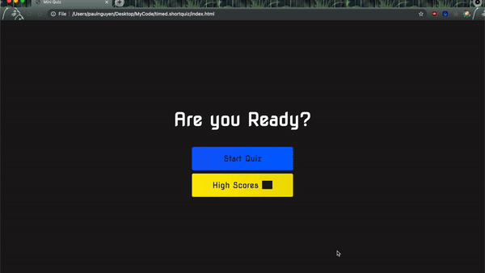

# **Timed Quiz**

## Description

This assignment i created a quiz with a score. timer and a scoreboard

### Html

The HTML document reference a reset script, styling and javascript.

the body element contains 3 sections; first one is meant for the rules.

second section contains the start button, but will be replaced by question and button for the quiz after the user has clicked the start button.

the last section is for the timer and score.

### CSS

In the styling the most important thing that needs mentioning is the class hide tag, that hides everything with this class. Which will be used by the javascript and will be how the quiz will work

### Javascript

The Javascript start off with all the const which is used for shortening traveling the DOM in the script. It is saved as a const because it has no need to be changed during the script

the var list is for variable that will change during the script, such as score, timer. Also a few things are set here as blank, so that i can have the variable saved in global when it get updated in the function

Then i have an object where i store all the questions

I have 2 eventlisteners which does the same action, it is only saved on a different button. The function is to start the quiz funtion.

scoreBoard Function will show the score and push the top 5 score into a list abd then show the retry button for the user if the user want to improve their score
